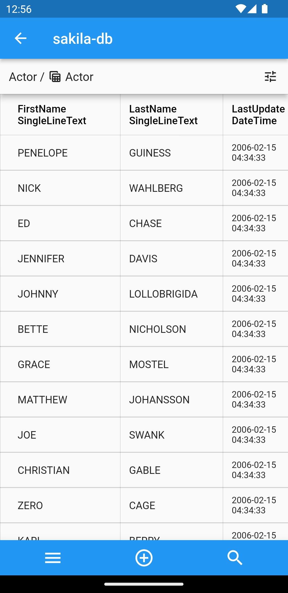
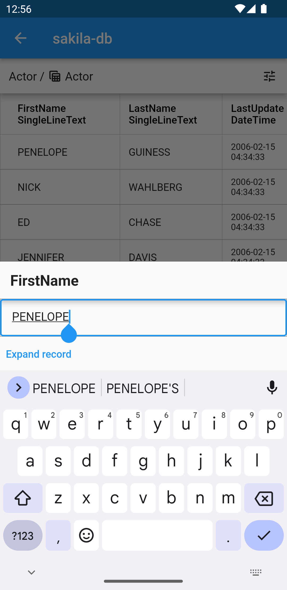

NocoDB Mobile
---

NocoDB Mobile is a prototype Android/iOS client for [NocoDB](https://github.com/nocodb/nocodb), an open-source alternative to Airtable.  
This project aims to make NocoDB's core functionality easily accessible from mobile devices.  
It is currently under development, and my immediate goals are to support the basic functionality of the Grid View feature of NocoDB and improve stability.

   

## How to try it out

It is currently not available on the Apple App Store or Google Play Store.

### Android

You can download the APK from the [release page](https://github.com/enm10k/nocodb-mobile/releases).  
Please note that you may need to turn off Google Play Protect to install the app.

### iOS

Please build it from the source code.

## Known issues and planned solutions

### Compatibility issues

At this point, NocoDB Mobile is tested with the latest version of NocoDB.  
I intend to support the latest three minor versions of NocoDB as much as possible in the future.
